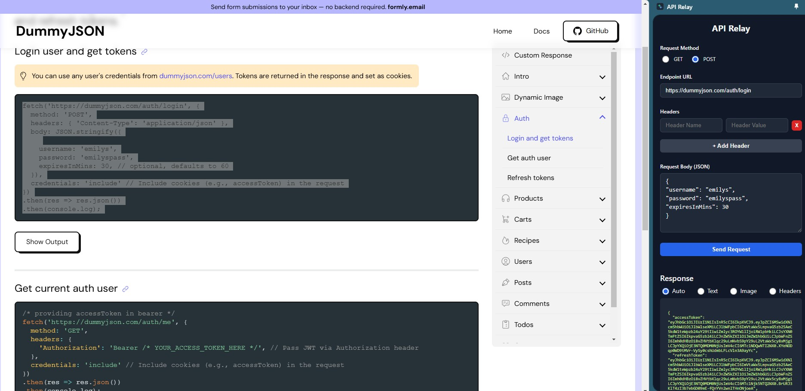

# API Relay
A lightweight and convenient Chrome extension that provides a sidebar to quickly test your API endpoints without leaving your current tab. Send GET and POST requests, add custom headers, and view responses in multiple formats.

## Why Use This Extension?
As a developer, you often need to quickly check an API endpoint or test a response. Switching between your browser, a code editor, and a dedicated API client like Postman can be cumbersome. This extension solves that by bringing a simple yet powerful API testing tool directly into your browser's sidebar. It's perfect for rapid testing, debugging, and development workflows.

## How to Use
1. __Open the Sidebar__: Click the extension's icon in your Chrome toolbar to open the sidebar.
2. __Select Method__: Choose either __GET__ or __POST__ for your request.
3. __Enter URL__: Paste the full API endpoint URL you want to test.
4. __Add Headers__ (optional):
    - Click the + Add Header button to create a new header row.
    - Enter the header name (e.g., `x-rapidapi-key`) and its value.
    - Add as many headers as you need.
5. __Add Body__ (for POST): If you selected POST, a body field will appear. Enter your JSON payload here.
6. __Send Request__: Click the Send Request button.
7. __View Response__: The response will appear at the bottom. You can switch between different views:
    - Auto: Automatically detects if the response is JSON, an image, or plain text.
    - Text: Shows the raw text body of the response.
    - Image: Attempts to render the response as an image.
    - Headers: Displays the status code and all response headers.
    

## Key Features
- __Convenient Sidebar UI__: No need to open a new tab or application.
- __GET & POST Support__: Covers the most common HTTP methods for testing.
- __Custom Headers__: Easily add any number of custom request headers, including authorization tokens.
- __Multiple Response Views__: Intelligently renders JSON, images, and raw text, or lets you choose the format.
- __Dark Mode Support__: Automatically adapts to your system's theme.
- __Lightweight & Fast__: Built with vanilla JavaScript for optimal performance.

## Permissions Explained
This extension requests a few permissions to provide its features. Here’s why each one is needed:

- `"sidePanel"`: This is the core permission that allows the extension to open its user interface in the browser's side panel.

- `"activeTab"` & `"scripting"`: These permissions are used together to enable the side panel on the currently active tab. The extension does not read or alter the content of the web pages you visit.

- `"storage"`: This permission is planned for future updates to save your request history, making it easier to re-run previous tests. Your data is stored locally and is never transmitted.

## Enjoying the Extension? Leave a Review!
If you find this tool helpful, please consider leaving a 5-star review on the Chrome Web Store! Your feedback helps the extension grow and motivates future development.

You can rate it directly from the review section at the bottom of the extension's sidebar.

## Support My Work
This extension is a free, open-source project created in my spare time. If it has saved you time and made your development process easier, please consider supporting its continued development with a small donation. Every little bit helps!

__Buy Me a Coffee__

Thank you for your support!